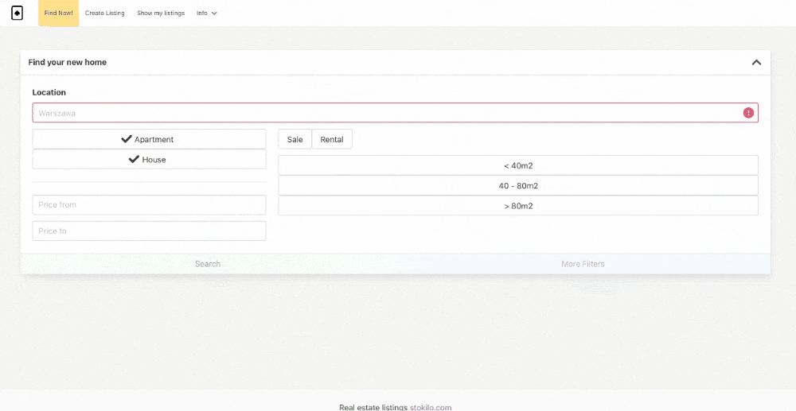
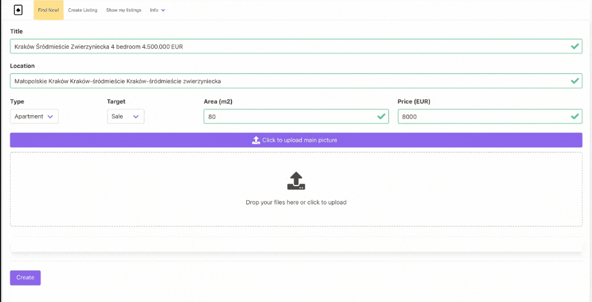
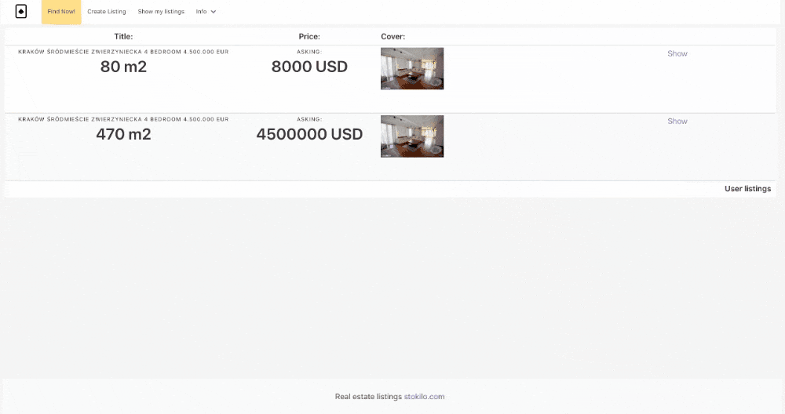

[](https://vshymanskyy.github.io/StandWithUkraine)

#### What is it?

See new version here:

https://github.com/stokilo/pelefele.com-public

Cloud spider real estate application. Sample serverless application implemented using serverless stack and NuxtJs.

The project configures two domains, one for API (awss.ws) and one for webapp (stokilo.com). These domains are configured for DEV and PROD
environments with subdomains:

dev.stokilo.com (DEV) -> dev.api.awss.ws 

stokilo.com (PROD) -> api.awss.ws.


VPN connection profile domain is set to vpn.awss.ws (CNAME must be updated manually with VPN endpoint value after CDK deployment).
This project is only demonstration and domains are hardcoded in IaC code and client config. You can however replace
them and use bring your own domains.

It is possible to bootstrap whole stack in 10 minutes (DynamoDb, VPC, VPN, OpenSearch, S3 ...). 
Monthly cost for running this stack is around 120$ .

Short video presenting all functionalities.

https://youtu.be/32n90gxumhc






#### What is included?

<ol>
<li>
Image upload and lambda resize in S3.
</li>
<li>
Static website hosting from S3.
</li>
<li>
Cloudflare CDN integration with S3.
</li>
<li>
Social login (Facebook, Google) and internal auth module.
</li>
<li>
CDK - SST IaC for all required services (S3, VPC, Vpn, OpenSearch, DynamoDb, Lambda).
</li>
<li>
Typescript frontend and backend codebase with shared components.
</li>
<li>
Bootstrap scripts admin panel for IAM users for initial project setup and migrations.
</li>
</ol>

#### Initial configuration

1. You need S3 bucket with name that match your domain. CDK will try to create one, but it is better to check if name
is available before initial deployment. 

After initial deployment you need to create a new website under Cloudflare admin panel. For example, for sample domain:

   stokilo.com

   Add two records to the DNS settings to static websites. Provide s3 bucket url for CNAME values.

```
CNAME: www.stokilo.com -> stokilo.com.s3-website.me-south-1.amazonaws.com
CNAME: stokilo.com     -> stokilo.com.s3-website.me-south-1.amazonaws.com
CNAME: prod-img        -> prod-img.stokilo.com.s3-website.me-south-1.amazonaws.com

 
CNAME: www.dev.stokilo.com     -> dev.stokilo.com.s3-website.me-south-1.amazonaws.com
CNAME: dev.stokilo.com         -> dev.stokilo.com.s3-website.me-south-1.amazonaws.com
CNAME: dev-img                 -> dev-img.stokilo.com.s3-website.me-south-1.amazonaws.com
```

Check domains.md file and configure subdomains for CDN.

2. Copy template.env to .env file. Exclude it from git. Fill all values.

   Create a developer application for facebook and google. Copy client and secret is to the env file.
 
   My API domain name is awss.ws . You should also change callback URL on your social login config panels. This can
be done after an initial deployment.

Configure API domain name. In my case it is api.awss.ws . Hosted zone is created manually and referenced in CDK,
replace REPLACE_ME_WITH_YUOR_HOSTED_ZONE* strings and your domain name under lib folder with your values. 

Initial setup will configure the domain, you can use it later for a callback env URL and on the social login panels.

```
App Domains
api.awss.ws
api.awss.ws/v1
```   

```
Website -> Valid OAuth Redirect URIs
https://api.awss.ws/v1/authenticate/oauth-step1
``` 

Update constants.js for frontend app.

3. Check lib/vpn.md to configure OpenVpn connection to the VPC.

4. Once connected install <strong>awscurl</strong>. You can check system status and use admin panel for initial configuration.

```
awscurl --service execute-api https://dev.api.awss.ws/v1/admin/panel\?action\=status --region me-south-1
```

Dry run migration 0.0.1 number 2
```
awscurl --service execute-api https://dev.api.awss.ws/v1/admin/panel\?action\=migrate\&version\=0.0.1\&orderNr\=2\&dryRun\=true  --region me-south-1
```

Migrate to 0.0.1 number 1 then number 2
```
awscurl --service execute-api https://dev.api.awss.ws/v1/admin/panel\?action\=migrate\&version\=0.0.1\&orderNr\=1  --region me-south-1
awscurl --service execute-api https://dev.api.awss.ws/v1/admin/panel\?action\=migrate\&version\=0.0.1\&orderNr\=2  --region me-south-1
```

#### Build

```
Start by installing the dependencies.
```bash
$ yarn install
```

#### Production deployment 
```bash
$ yarn deploy --stage prod
```

#### Development with live lambda reload

```bash
$ yarn start
```

#### Run unit and integration tests

```bash
$ yarn test
$ yarn integ-test
```

#### Frontend (localhost:3000)
```bash
$ cd frontend
$ yarn install
$ yarn run dev
```
